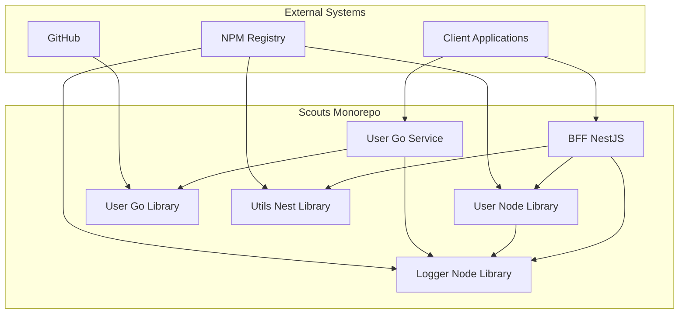

# Arquitetura do Monorepo Scouts

## Visão Geral

O monorepo Scouts é uma aplicação híbrida que combina tecnologias TypeScript/Node.js e Go, gerenciada pelo Nx para otimizar o desenvolvimento e deployment. A arquitetura segue princípios de Clean Architecture, Domain-Driven Design (DDD) e microserviços.

## Diagrama C4 - Context



## Estrutura do Monorepo

```
scouts/
├── apps/                          # Aplicações
│   ├── bff-nest/                 # Backend for Frontend (NestJS)
│   └── user-go-service/          # Serviço de usuários (Go)
├── libs/                         # Bibliotecas compartilhadas
│   ├── user-node/               # Biblioteca de usuários (TypeScript)
│   ├── user-go/                 # Biblioteca de usuários (Go)
│   ├── logger-node/             # Biblioteca de logging (TypeScript)
│   ├── utils-nest/              # Utilitários NestJS (TypeScript)
│   └── biome-base/              # Configuração Biome
├── docs/                         # Documentação
└── scripts/                      # Scripts de automação
```

## Arquitetura por Camadas

### 1. Camada de Aplicação (Apps)

#### BFF NestJS (`apps/bff-nest`)
- **Responsabilidade**: Backend for Frontend, agregação de dados
- **Tecnologia**: NestJS, TypeScript
- **Dependências**: `@scouts/user-node`, `@scouts/logger-node`, `@scouts/utils-nest`
- **Endpoints**: `/users`, `/health`, `/monitoring`

#### User Go Service (`apps/user-go-service`)
- **Responsabilidade**: Serviço dedicado de usuários
- **Tecnologia**: Go, Echo framework
- **Dependências**: `libs/user-go`
- **Endpoints**: `/api/v1/users`, `/health`, `/health/ready`, `/health/live`

### 2. Camada de Domínio (Libraries)

#### User Node Library (`libs/user-node`)
- **Responsabilidade**: Lógica de negócio de usuários (TypeScript)
- **Padrões**: Repository Pattern, Domain Events
- **Componentes**:
  - `User` (Entity)
  - `UserService` (Domain Service)
  - `UserRepository` (Interface)
  - `InMemoryUserRepository` (Implementation)
  - `CreateUserDto`, `UpdateUserDto` (DTOs)

#### User Go Library (`libs/user-go`)
- **Responsabilidade**: Lógica de negócio de usuários (Go)
- **Padrões**: Repository Pattern, Domain Events, Context Pattern
- **Componentes**:
  - `User` (Struct)
  - `UserService` (Domain Service)
  - `UserRepository` (Interface)
  - `InMemoryUserRepository` (Implementation)
  - `CreateUserData`, `UpdateUserData` (Data Types)

### 3. Camada de Infraestrutura (Libraries)

#### Logger Node Library (`libs/logger-node`)
- **Responsabilidade**: Logging estruturado
- **Features**: Correlation IDs, Redaction, Multiple Sinks
- **Integração**: NestJS, Express, Fastify

#### Utils Nest Library (`libs/utils-nest`)
- **Responsabilidade**: Utilitários para NestJS
- **Features**: Health Checks, Swagger, Logger Integration
- **Componentes**: Health Module, Logger Module, Swagger Module

## Padrões Arquiteturais

### 1. Clean Architecture

```
┌─────────────────────────────────────┐
│           Presentation              │
│  (Controllers, Handlers, Routes)   │
├─────────────────────────────────────┤
│           Application               │
│        (Use Cases, Services)       │
├─────────────────────────────────────┤
│            Domain                   │
│    (Entities, Business Logic)     │
├─────────────────────────────────────┤
│         Infrastructure         │
│    (Repositories, External APIs)   │
└─────────────────────────────────────┘
```

### 2. Domain-Driven Design (DDD)

#### Bounded Contexts
- **User Management**: Gerenciamento de usuários
- **Logging**: Sistema de logs
- **Health Monitoring**: Monitoramento de saúde

#### Aggregates
- **User Aggregate**: User entity + UserService + UserRepository

### 3. Repository Pattern

```typescript
// TypeScript Interface
interface UserRepository {
  create(data: CreateUserData): Promise<User>;
  findById(id: string): Promise<User | null>;
  findAll(): Promise<User[]>;
  update(id: string, data: UpdateUserData): Promise<User | null>;
  delete(id: string): Promise<boolean>;
}
```

```go
// Go Interface
type UserRepository interface {
    Create(ctx context.Context, data CreateUserData) (*User, error)
    FindByID(ctx context.Context, id string) (*User, error)
    FindAll(ctx context.Context) ([]*User, error)
    Update(ctx context.Context, id string, data UpdateUserData) (*User, error)
    Delete(ctx context.Context, id string) error
}
```

### 4. Event-Driven Architecture

#### Domain Events
```typescript
interface UserEvents {
  onUserCreated(user: User): void;
  onUserUpdated(user: User): void;
  onUserDeleted(userId: string): void;
}
```

## Fluxo de Dados

### 1. Fluxo de Criação de Usuário (BFF)

```
Client → BFF Controller → UsersService → UserService (lib) → InMemoryRepository
                     ↓
                 Logger (Structured Logging)
```

### 2. Fluxo de Criação de Usuário (Go Service)

```
Client → Echo Handler → UserHandler → UserService (lib) → InMemoryRepository
                    ↓
                Logger (Structured Logging)
```

## Decisões Arquiteturais (ADRs)

### ADR-001: Monorepo com Nx
**Decisão**: Usar Nx para gerenciar o monorepo
**Justificativa**: 
- Compartilhamento de código entre projetos
- Cache inteligente para builds e testes
- Gerenciamento de dependências simplificado
- CI/CD otimizado

### ADR-002: Híbrido TypeScript/Go
**Decisão**: Usar TypeScript para BFF e Go para serviços especializados
**Justificativa**:
- TypeScript: Ecossistema rico, desenvolvimento rápido
- Go: Performance, concorrência nativa, deploy simples

### ADR-003: Repository Pattern
**Decisão**: Implementar Repository Pattern para abstração de dados
**Justificativa**:
- Testabilidade (mocks fáceis)
- Flexibilidade (troca de implementações)
- Separação de responsabilidades

### ADR-004: In-Memory Repository
**Decisão**: Implementar repositório em memória para desenvolvimento
**Justificativa**:
- Desenvolvimento rápido
- Testes unitários
- Demonstração de conceitos

## Qualidade e Testes

### Estratégia de Testes

```
┌─────────────────────────────────────┐
│           E2E Tests                │
│    (Full Application Flow)         │
├─────────────────────────────────────┤
│        Integration Tests           │
│    (Component Integration)        │
├─────────────────────────────────────┤
│          Unit Tests                │
│      (Individual Components)       │
└─────────────────────────────────────┘
```

### Cobertura de Testes
- **Libraries**: ≥ 85% (Go), ≥ 90% (TypeScript)
- **Applications**: ≥ 70%
- **Integration**: ≥ 70%

### Ferramentas de Qualidade
- **Linting**: ESLint (TS), golangci-lint (Go)
- **Formatting**: Biome (TS), gofmt (Go)
- **Type Checking**: TypeScript, Go compiler
- **Testing**: Jest (TS), Go testing package

## Monitoramento e Observabilidade

### Logging Estruturado
- **Correlation IDs**: Rastreamento de requisições
- **Structured Logs**: JSON format
- **Log Levels**: Debug, Info, Warn, Error, Fatal
- **Redaction**: Dados sensíveis automaticamente removidos

### Health Checks
- **BFF**: `/health`, `/monitoring`
- **Go Service**: `/health`, `/health/ready`, `/health/live`

### Métricas
- **Performance**: Response times, throughput
- **Errors**: Error rates, error types
- **Business**: User operations, system health

## Segurança

### Princípios
- **Least Privilege**: Mínimo de permissões necessárias
- **Defense in Depth**: Múltiplas camadas de segurança
- **Input Validation**: Validação rigorosa de entrada
- **Error Handling**: Não exposição de informações sensíveis

### Implementações
- **CORS**: Configurável por ambiente
- **Request Timeout**: 30 segundos
- **Input Validation**: class-validator (TS), custom validation (Go)
- **Log Redaction**: Dados sensíveis removidos automaticamente

## Performance

### Otimizações
- **Nx Cache**: Build e test caching
- **Go Concurrency**: Goroutines para operações paralelas
- **Memory Management**: Garbage collection otimizado
- **Database**: Connection pooling (futuro)

### Benchmarks
- **Go Service**: ~10k requests/second
- **BFF**: ~5k requests/second
- **Memory Usage**: < 100MB por serviço

## Escalabilidade

### Estratégias
- **Horizontal Scaling**: Múltiplas instâncias
- **Load Balancing**: Distribuição de carga
- **Caching**: Redis para cache distribuído (futuro)
- **Database**: Sharding por tenant (futuro)

### Limitações Atuais
- **In-Memory Storage**: Não persistente
- **Single Instance**: Sem clustering
- **No Database**: Apenas memória

## Roadmap Técnico

### Fase 1: Infraestrutura Base ✅
- [x] Quality gates
- [x] Module boundaries

### Fase 2: Libraries ✅
- [x] User Node Library
- [x] User Go Library
- [x] Testes completos

### Fase 3: Applications ✅
- [x] BFF NestJS integration
- [x] Go Service implementation
- [x] Health checks

### Fase 4: Melhorias (Futuro)
- [ ] Database integration (PostgreSQL)
- [ ] Redis caching
- [ ] Distributed tracing
- [ ] Metrics collection
- [ ] Authentication/Authorization
- [ ] API Gateway
- [ ] Message queues
- [ ] Event sourcing

## Conclusão

A arquitetura do monorepo Scouts foi projetada para ser:

- **Escalável**: Suporte a crescimento horizontal e vertical
- **Manutenível**: Código limpo, bem testado e documentado
- **Flexível**: Fácil adição de novos serviços e funcionalidades
- **Performante**: Otimizada para alta performance
- **Observável**: Logs, métricas e health checks integrados

A combinação de TypeScript/Node.js e Go permite aproveitar o melhor de cada ecossistema, enquanto o Nx garante a eficiência do desenvolvimento em monorepo.
