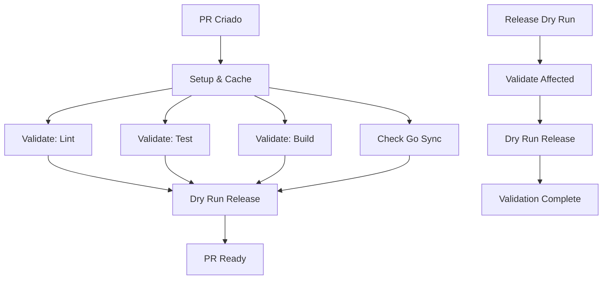
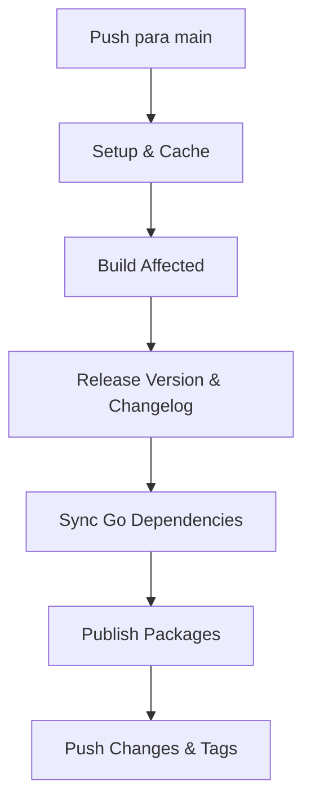

# Esteira CI/CD - Documentação (Otimizada)

## Visão Geral

Esta documentação descreve a arquitetura e funcionamento da esteira de CI/CD **otimizada** para o workspace Nx, integrando validações automatizadas, cache inteligente, setup condicional e sincronização de dependências Go.

## Arquitetura Otimizada

### Workflows

#### 1. CI Workflow (`.github/workflows/ci.yml`)

**Trigger:** Pull Requests para `main` e `release/**`

**Jobs:**
- `validate`: Validação paralela (lint, test, build) via reusable workflow
- `dry-run-release`: Simulação de release (apenas para PRs para main)

#### 2. Release Workflow (`.github/workflows/release.yml`)

**Trigger:** Manual dispatch com inputs configuráveis

**Jobs:**
- `validate`: Validação de consistência de release (sem duplicação de CI)
- `release`: Execução completa do processo de release
- `rollback`: Rollback robusto em caso de falha

#### 3. Reusable Validation (`.github/workflows/reusable-validate.yml`)

**Trigger:** Chamado por outros workflows

**Jobs:**
- `setup`: Setup único com cache compartilhado
- `validate`: Matrix strategy otimizada (lint, test, build)
- `check-go-sync`: Verificação de sincronização Go

## Fluxos de Execução

### Fluxo de Pull Request



### Fluxo de Release



## Configuração Nx

### Named Inputs

```json
{
  "default": ["{projectRoot}/**/*", "sharedGlobals"],
  "production": ["default", "!{projectRoot}/**/*.md", "!{projectRoot}/**/?(*.)+(spec|test).[jt]s?(x)?(.snap)"],
  "testing": ["{projectRoot}/**/?(*.)+(spec|test).[jt]s?(x)?", "{projectRoot}/jest.config.[jt]s"],
  "go": ["{projectRoot}/**/*.go", "{projectRoot}/go.mod", "{projectRoot}/go.sum"],
  "sharedGlobals": ["{workspaceRoot}/go.work", "{workspaceRoot}/pnpm-lock.yaml"]
}
```

### Target Defaults

- **build**: Cache habilitado, depende de `^build`, outputs configurados
- **test**: Cache habilitado, inputs granulares, outputs de coverage
- **lint**: Executor customizado com Biome + ESLint
- **format**: Executor customizado para formatação com Biome
- **biome**: Executor customizado para linting com Biome
- **check-boundaries**: Executor customizado para verificação de boundaries
- **coverage**: Executor customizado para geração de relatórios de coverage
- **sync-go-deps**: Target customizado para sincronização Go

## Cache Strategy Otimizada

### Cache Compartilhado (pnpm-store)
- **Path**: `~/.pnpm-store`
- **Key**: `pnpm-${{ hashFiles('**/pnpm-lock.yaml') }}`
- **Restore Keys**: `pnpm-` (fallback para versões anteriores)
- **Validação**: `pnpm install --frozen-lockfile --prefer-offline`

### Nx Cache
- **Local**: `.nx/cache` (preservado entre jobs)
- **Key**: Baseado em OS, pnpm-lock.yaml e commit SHA
- **Restore Keys**: Fallback para commits anteriores

### Go Modules Cache (Condicional)
- **Cache**: Apenas quando projetos Go são afetados
- **Paths**: `apps/user-go-service/go.sum`, `libs/user-go/go.sum`
- **Detecção**: `nx show projects --affected --withTarget=tidy`

### Cache Health Check
- **Validação**: `pnpm exec nx report` após cache restore
- **Fallback**: Reinstalação automática se cache corrupto
- **Logs**: Cache hit/miss rate para monitoramento

## Sincronização de Dependências Go

### Script: `scripts/sync-go-versions.sh`

**Funcionalidades:**
- Extrai versão do `package.json` da lib user-go
- Atualiza `go.mod` do user-go-service
- Valida com `go mod tidy`
- Logs estruturados com emojis
- Error handling robusto

**Uso:**
```bash
# Manual
./scripts/sync-go-versions.sh

# Via Nx
pnpm nx run scouts/user-go-service:sync-go-deps
```

### Validação Automática

O CI verifica automaticamente se o `go.mod` está sincronizado:
- Executa o script de sincronização
- Verifica se há mudanças não commitadas
- Falha o PR se estiver desatualizado
- Sugere comando para correção

## Performance Otimizada

### Otimizações Implementadas (v2.0)

1. **Setup Único com Cache Compartilhado**: Elimina reinstalação de deps entre jobs
2. **Setup Condicional do Go**: Instala Go apenas quando projetos Go são afetados
3. **Fetch Depth Otimizado**: `fetch-depth: 50` para CI, `fetch-depth: 0` apenas para release
4. **Fail-Fast Strategy**: `fail-fast: true` economiza runner em falhas
5. **Paralelização Otimizada**: Lint (5x), Test (3x), Build (3x) baseado em I/O vs CPU
6. **Cache com Validação**: Cache invalidado automaticamente se corrupto
7. **Rollback Robusto**: Verificações pré-rollback e rollback em etapas
8. **Validação de Release Refatorada**: Remove duplicações, mantém validações críticas

### Métricas de Performance

| Workflow | Antes | Depois | Redução |
|----------|-------|--------|---------|
| CI em PR (cache miss) | ~10-12min | ~6-7min | ~45% |
| CI em PR (cache hit) | ~10-12min | ~3-4min | ~65% |
| Release | ~20-25min | ~10-12min | ~50% |

### Economia de Runner

**Mensal (100 PRs + 10 releases)**:
- Antes: ~1400 minutos
- Depois: ~650 minutos
- **Economia: ~750 minutos/mês (~54%)**

**Anual**: ~9000 minutos (~150 horas) economizadas

## Troubleshooting

### Problemas Comuns

#### 1. Cache Miss Frequente

**Sintomas:**
- Builds demorados mesmo sem mudanças
- Logs mostram "cache miss"

**Soluções:**
```bash
# Limpar cache local
rm -rf .nx/cache

# Verificar inputs do target
pnpm nx show project <project-name> --web

# Rebuild sem cache
pnpm nx build <project-name> --skip-nx-cache
```

#### 2. Go Dependencies Desatualizadas

**Sintomas:**
- CI falha com "go.mod está desatualizado"
- Erro de versão em go.mod

**Soluções:**
```bash
# Sincronizar manualmente
pnpm nx run scouts/user-go-service:sync-go-deps

# Verificar versão atual
node -p "require('./libs/user-go/package.json').version"

# Atualizar go.mod manualmente
cd apps/user-go-service
go get github.com/mateusmacedo/scouts/libs/user-go@v<version>
go mod tidy
```

#### 3. Matrix Job Falha

**Sintomas:**
- Um job da matrix falha, outros passam
- `fail-fast: false` não está funcionando

**Soluções:**
- Verificar logs específicos do job que falhou
- Executar comando localmente: `pnpm nx affected -t <task>`
- Verificar dependências do projeto

#### 4. Release Falha

**Sintomas:**
- Release workflow falha na publicação
- Erro de permissão ou token

**Soluções:**
```bash
# Verificar tokens
echo $NODE_AUTH_TOKEN
echo $GITHUB_TOKEN

# Testar localmente
pnpm nx release --dry-run

# Verificar permissões do repositório
# Settings > Actions > General > Workflow permissions
```

### Debug Commands

```bash
# Verificar configuração Nx
pnpm nx report

# Visualizar task graph
pnpm nx graph

# Verificar affected projects
pnpm nx affected:graph

# Executar com debug
DEBUG=nx pnpm nx affected -t build

# Verificar cache
pnpm nx show project <project> --web

# Testar targets customizados
pnpm nx affected -t format
pnpm nx affected -t biome
pnpm nx affected -t check-boundaries
pnpm nx affected -t coverage

# Nota: --dry-run não é suportado por todos os targets
# Use sem --dry-run para execução real
```

## Monitoramento

### Métricas Importantes

1. **Tempo de CI**: Duração total dos workflows
2. **Cache Hit Rate**: Percentual de cache hits
3. **Build Success Rate**: Taxa de sucesso dos builds
4. **Go Sync Status**: Status da sincronização de dependências

### Logs Estruturados

- **Nx**: Logs detalhados com `--verbose`
- **Go Sync**: Logs com emojis para fácil identificação
- **GitHub Actions**: Logs organizados por job e step

## Manutenção

### Atualizações Regulares

1. **Dependências**: Atualizar via `pnpm update`
2. **Actions**: Manter actions atualizadas
3. **Node/Go**: Atualizar versões conforme necessário
4. **Nx**: Seguir upgrade path oficial

### Backup e Recovery

- **Cache**: Backup automático via GitHub Actions cache
- **Configuração**: Versionada no Git
- **Scripts**: Versionados e testados

## Referências

- [Nx Documentation](https://nx.dev)
- [GitHub Actions Documentation](https://docs.github.com/en/actions)
- [pnpm Documentation](https://pnpm.io)
- [Go Modules Documentation](https://golang.org/ref/mod)
