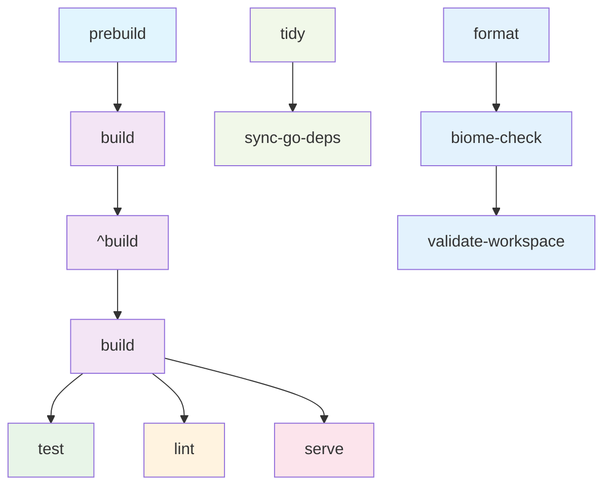

# Pipeline de Tasks Nx

Este documento descreve o pipeline de tasks configurado no template Nx e como as dependências entre tasks são gerenciadas.

## Visão Geral do Pipeline

O pipeline de tasks garante que as tasks sejam executadas na ordem correta, respeitando dependências entre projetos e otimizando a execução paralela quando possível.

## Diagrama do Pipeline



## Configuração Global (nx.json)

### Target Defaults

```json
{
  "targetDefaults": {
    "build": {
      "cache": true,
      "dependsOn": ["^build"],
      "inputs": ["production", "^production", "sharedGlobals"],
      "outputs": ["{workspaceRoot}/dist/{projectRoot}", "{projectRoot}/dist"]
    },
    "test": {
      "cache": true,
      "dependsOn": ["^build"],
      "inputs": ["default", "^production", "testing", "sharedGlobals"],
      "outputs": ["{workspaceRoot}/coverage/{projectRoot}"]
    },
    "lint": {
      "cache": true,
      "dependsOn": ["^build"],
      "inputs": ["linting", "sharedGlobals"]
    },
    "serve": {
      "dependsOn": ["build"],
      "cache": false
    },
    "tidy": {
      "cache": true,
      "inputs": ["go", "sharedGlobals"]
    },
    "sync-go-deps": {
      "cache": false,
      "inputs": ["go", "sharedGlobals"]
    }
  }
}
```

## Dependências por Target

### 1. Build Pipeline

```
^build → build
```

- **`^build`**: Builda todas as dependências primeiro
- **`build`**: Builda o projeto atual
- **Ordem**: Dependências são buildadas antes do projeto principal

### 2. Test Pipeline

```
^build → build → test
```

- **`^build`**: Builda dependências
- **`build`**: Builda projeto atual
- **`test`**: Executa testes
- **Garantia**: Testes sempre executam com código buildado

### 3. Lint Pipeline

```
^build → build → lint
```

- **`^build`**: Builda dependências
- **`build`**: Builda projeto atual
- **`lint`**: Executa linting
- **Garantia**: Linting sempre executa com tipos gerados

### 4. Serve Pipeline

```
build → serve
```

- **`build`**: Builda projeto antes de servir
- **`serve`**: Inicia servidor de desenvolvimento
- **Sem cache**: Serve sempre executa

### 5. Go Pipeline

```
tidy → sync-go-deps
```

- **`tidy`**: Limpa dependências Go
- **`sync-go-deps`**: Sincroniza versões Go
- **Específico**: Apenas para projetos Go

## Configuração por Projeto

### Projetos Node.js

#### Aplicações NestJS

```json
{
  "targets": {
    "build": {
      "executor": "nx:run-commands",
      "outputs": ["{workspaceRoot}/dist/{projectRoot}"],
      "options": {
        "command": "webpack-cli build"
      }
    },
    "serve": {
      "executor": "@nx/js:node",
      "options": {
        "buildTarget": "<project-name>:build"
      }
    }
  }
}
```

#### Aplicações Express

```json
{
  "targets": {
    "build": {
      "executor": "@nx/webpack:webpack",
      "outputs": ["{options.outputPath}"],
      "options": {
        "outputPath": "dist/apps/<project-name>"
      }
    }
  }
}
```

### Projetos Go

#### Serviços Go

```json
{
  "targets": {
    "build": {
      "executor": "@nx-go/nx-go:build",
      "inputs": ["go", "sharedGlobals"],
      "outputs": ["{projectRoot}/dist", "{workspaceRoot}/dist/apps/<project-name>"]
    },
    "test": {
      "executor": "@nx-go/nx-go:test",
      "inputs": ["go", "sharedGlobals"]
    },
    "lint": {
      "executor": "@nx-go/nx-go:lint",
      "inputs": ["go", "sharedGlobals"]
    },
    "tidy": {
      "executor": "@nx-go/nx-go:tidy",
      "inputs": ["go", "sharedGlobals"]
    },
    "sync-go-deps": {
      "executor": "nx:run-commands",
      "inputs": ["go", "sharedGlobals"],
      "options": {
        "command": "./scripts/sync-go-versions.sh"
      }
    }
  }
}
```

## Execução Paralela

### Configuração Global

```json
{
  "parallel": 5,
  "targetDefaults": {
    "build": {
      "options": {
        "parallel": true
      }
    },
    "test": {
      "options": {
        "parallel": true
      }
    },
    "lint": {
      "options": {
        "parallel": true
      }
    }
  }
}
```

### Estratégias de Paralelização

1. **Por Target**: Múltiplos projetos executam o mesmo target em paralelo
2. **Por Dependência**: Projetos independentes executam simultaneamente
3. **Por Runtime**: Projetos Node e Go podem executar em paralelo

## Cache e Invalidação

### Inputs Configurados

```json
{
  "namedInputs": {
    "default": ["{projectRoot}/**/*", "sharedGlobals"],
    "production": ["default", "!{projectRoot}/**/*.spec.ts"],
    "testing": ["{projectRoot}/**/*.spec.ts", "{projectRoot}/**/*.test.ts"],
    "linting": ["{projectRoot}/**/*.ts", "{projectRoot}/**/*.js"],
    "go": ["{projectRoot}/**/*.go", "{projectRoot}/go.mod", "{projectRoot}/go.sum"],
    "sharedGlobals": [
      "{workspaceRoot}/go.work",
      "{workspaceRoot}/go.work.sum",
      "{workspaceRoot}/pnpm-lock.yaml",
      "{workspaceRoot}/nx.json"
    ]
  }
}
```

### Outputs Configurados

```json
{
  "targetDefaults": {
    "build": {
      "outputs": ["{workspaceRoot}/dist/{projectRoot}", "{projectRoot}/dist"]
    },
    "test": {
      "outputs": ["{workspaceRoot}/coverage/{projectRoot}"]
    }
  }
}
```

## Comandos de Pipeline

### Execução Completa

```bash
# Executar pipeline completo
pnpm nx run-many -t build test lint

# Executar apenas projetos afetados
pnpm nx affected -t build test lint

# Executar com paralelização
pnpm nx run-many -t build --parallel=3
```

### Execução por Fase

```bash
# Fase 1: Build
pnpm nx run-many -t build

# Fase 2: Test
pnpm nx run-many -t test

# Fase 3: Lint
pnpm nx run-many -t lint
```

### Execução por Runtime

```bash
# Apenas projetos Node
pnpm nx run-many -t build --projects=<node-project-1>,<node-project-2>

# Apenas projetos Go
pnpm nx run-many -t build --projects=<go-project-1>,<go-project-2>
```

## Monitoramento do Pipeline

### Verificar Dependências

```bash
# Ver grafo de dependências
pnpm nx graph

# Ver grafo de tasks
pnpm nx graph --focus=<project-name>

# Ver pipeline de um projeto
pnpm nx show project <project-name> --web
```

### Verificar Cache

```bash
# Ver estatísticas de cache
pnpm nx show project <project-name> --web

# Executar com verbose para ver cache hits
pnpm nx run-many -t build --verbose

# Limpar cache
pnpm nx reset
```

## Troubleshooting

### Problema: Tasks Executando em Ordem Incorreta

**Sintomas:**
- Testes falhando por falta de build
- Lint falhando por tipos não gerados

**Soluções:**
1. Verificar `dependsOn` nos targetDefaults
2. Verificar se projeto tem dependências corretas
3. Executar `pnpm nx graph` para visualizar dependências

### Problema: Paralelização Ineficiente

**Sintomas:**
- Tasks executando sequencialmente quando poderiam ser paralelas
- Build demorando mais que esperado

**Soluções:**
1. Verificar se `parallel: true` está configurado
2. Verificar se dependências estão corretas
3. Ajustar `parallel` global se necessário

### Problema: Cache Miss Inesperado

**Sintomas:**
- Tasks executando mesmo sem mudanças
- Build demorando mais que esperado

**Soluções:**
1. Verificar inputs configurados
2. Verificar se arquivos estão sendo incluídos incorretamente
3. Executar `pnpm nx reset` para limpar cache

## Boas Práticas

1. **Sempre configure `dependsOn`** para targets que dependem de outros
2. **Use `^build`** para garantir que dependências sejam buildadas
3. **Configure inputs e outputs** corretamente para cache
4. **Monitore execução** com `--verbose` quando necessário
5. **Use `nx graph`** para visualizar dependências
6. **Teste pipeline** em ambiente isolado antes de aplicar
7. **Documente exceções** quando pipeline não segue padrão

## Release e Publicação

O processo de release é parte integrante do pipeline de tasks, garantindo que as bibliotecas sejam versionadas e publicadas corretamente.

### Configuração de Release (nx.json)

```json
{
  "release": {
    "version": {
      "conventionalCommits": {
        "preset": "conventionalcommits"
      },
      "generatorOptions": {
        "currentVersionResolver": "git-tag",
        "specifierSource": "conventional-commits"
      }
    },
    "changelog": {
      "workspaceChangelog": {
        "createRelease": "github",
        "entryWhenNoChanges": "This was a version bump only, there were no code changes.",
        "file": "{workspaceRoot}/CHANGELOG.md"
      },
      "projectChangelogs": true
    },
    "projects": {
      "relationship": "independent"
    }
  }
}
```

### Processo de Release Automático (via CI)

1. **Push para main** - Workflow detecta mudanças
2. **Versiona projetos afetados** - Baseado em conventional commits
3. **Cria changelog** - Atualiza CHANGELOG.md automaticamente
4. **Publica pacotes** - Para npm registry
5. **Cria GitHub Release** - Com notas de release

### Processo de Release Manual

```bash
# 1. Versionar projetos afetados
pnpm exec nx release version

# 2. Buildar projetos afetados
pnpm exec nx affected -t build

# 3. Publicar pacotes
pnpm exec nx release publish
```

### Projetos Publicáveis

Os seguintes tipos de projetos podem ser configurados para publicação:

- **Bibliotecas TypeScript**: `@scope/library-name`
- **Bibliotecas Go**: `go:public` scope
- **Configurações compartilhadas**: `@scope/config-name`

### Comandos de Release

#### Versionamento

```bash
# Versionar todos os projetos
pnpm exec nx release version

# Versionar apenas projetos afetados
pnpm exec nx release version --projects=<project-name>

# Dry run (simular sem aplicar)
pnpm exec nx release version --dry-run
```

#### Publicação

```bash
# Publicar todos os projetos
pnpm exec nx release publish

# Publicar apenas projetos específicos
pnpm exec nx release publish --projects=<project-name>

# Dry run (simular sem publicar)
pnpm exec nx release publish --dry-run
```

#### Changelog

```bash
# Gerar changelog
pnpm exec nx release changelog

# Atualizar changelog para versão específica
pnpm exec nx release changelog --version=1.2.3
```

### Integração com Pipeline de Tasks

O release se integra naturalmente com o pipeline de tasks:

```bash
# Pipeline completo incluindo release
pnpm nx affected -t build test lint
pnpm nx release version
pnpm nx release publish
```

### Monitoramento de Release

```bash
# Ver status do release
pnpm exec nx release --help

# Ver projetos configurados para release
pnpm exec nx show project <project-name> --web

# Ver histórico de releases
git log --oneline --grep="release"
```

### Troubleshooting de Release

#### Problema: Release Falhando

**Sintomas:**
- Versionamento não aplicado
- Publicação falhando
- Changelog não gerado

**Soluções:**
1. Verificar conventional commits
2. Verificar configuração de release no nx.json
3. Verificar permissões de publicação
4. Executar com `--dry-run` para debug

#### Problema: Projetos Não Sendo Versionados

**Sintomas:**
- Projetos não aparecem no release
- Versionamento inconsistente

**Soluções:**
1. Verificar se projeto tem `package.json` com `version`
2. Verificar se projeto tem conventional commits
3. Verificar configuração de `projects` no release

### Boas Práticas de Release

1. **Use conventional commits** - Para versionamento automático
2. **Teste antes de publicar** - Execute pipeline completo
3. **Monitore dependências** - Verifique se dependências estão atualizadas
4. **Documente breaking changes** - Use `BREAKING CHANGE:` nos commits
5. **Use dry-run** - Sempre teste antes de aplicar
6. **Mantenha changelog atualizado** - Para rastreabilidade
7. **Version independente** - Cada projeto tem seu próprio ciclo de release

## Referências

- [Nx Task Pipeline](https://nx.dev/concepts/task-pipeline-configuration)
- [Nx Cache](https://nx.dev/features/cache-task-results)
- [Nx Graph](https://nx.dev/features/explore-graph)
- [Nx Release](https://nx.dev/features/release)

