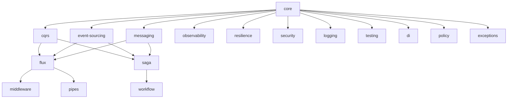

# Estrutura de Bibliotecas

## Core Libraries

### @org/core
Base abstractions and common utilities

- [Result<T, E>](/docs/meta-model.md#result)
- [IDomainEvent](/docs/meta-model.md#idomainevent)
- [IAggregateRoot](/docs/meta-model.md#iaggregateroot)
- [IRepository<T, E>](/docs/meta-model.md#irepository)

### @org/cqrs
CQRS pattern implementation

- [ICommand](/docs/meta-model.md#icommand)
- [ICommandHandler<TCommand, E>](/docs/meta-model.md#icommandhandler)
- [IQuery<TResult>](/docs/meta-model.md#iquery)
- [IQueryHandler<TQuery, TResult, E>](/docs/meta-model.md#iqueryhandler)

### @org/event-sourcing
Event sourcing infrastructure

- [IEventStore](/docs/meta-model.md#ieventstore)
- [IEventBus](/docs/meta-model.md#ieventbus)
- [IProjection<TReadModel>](/docs/meta-model.md#iprojection)
- [InMemoryEventStore](/docs/meta-model.md#inmemoryeventstore)
- [RxEventBus](/docs/meta-model.md#rxeventbus)

### @org/messaging
Messaging and communication patterns

- [IMessageChannel<TMessage>](/docs/meta-model.md#imessagechannel)
- [IMessageRouter<TMessage>](/docs/meta-model.md#imessagerouter)
- [IMessageTranslator<TInput, TOutput>](/docs/meta-model.md#imessagetranslator)
- [IMessageProcessor<TMessage>](/docs/meta-model.md#imessageprocessor)
- [IMessageBroker](/docs/meta-model.md#imessagebroker)
- [MessageBroker](/docs/meta-model.md#messagebroker)

## Infrastructure Libraries

### @org/observability
Monitoring and observability tools

- [IObservable<T>](/docs/meta-model.md#iobservable)
- [IObserver<T>](/docs/meta-model.md#iobserver)
- [ITracing](/docs/meta-model.md#itracing)
- [ISpan](/docs/meta-model.md#ispan)
- [Tracer](/docs/meta-model.md#tracer)

### @org/resilience
Resilience and fault-tolerance patterns

- [CircuitBreaker](/docs/meta-model.md#circuitbreaker)
- [RetryPolicy](/docs/meta-model.md#retrypolicy)
- [OutboxMessage](/docs/meta-model.md#outboxmessage)
- [IOutboxRepository](/docs/meta-model.md#ioutboxrepository)

### @org/security
Security and authentication

- [IDataMasking](/docs/meta-model.md#idatamasking)
- [DataMasking](/docs/meta-model.md#datamasking)
- [IAuthenticationService](/docs/meta-model.md#iauthenticationservice)
- [AuthenticationMiddleware](/docs/meta-model.md#authenticationmiddleware)

### @org/logging
Logging and audit infrastructure

- [ILogger](/docs/meta-model.md#ilogger)
- [ConsoleLogger](/docs/meta-model.md#consolelogger)
- [IAuditService](/docs/meta-model.md#iauditservice)
- [AuditService](/docs/meta-model.md#auditservice)

## Pipeline Libraries

### @org/flux
Data pipeline processing

- [Pipeline<TInput, TOutput>](/docs/meta-model.md#pipeline)
- [Stage<TInput, TOutput>](/docs/meta-model.md#stage)
- [TransformationStage<TInput, TOutput>](/docs/meta-model.md#transformationstage)
- [ValidationStage<T>](/docs/meta-model.md#validationstage)

### @org/middleware
Middleware and interceptor patterns

- [IMiddleware](/docs/meta-model.md#imiddleware)
- [IInterceptor](/docs/meta-model.md#iinterceptor)
- [LoggingInterceptor](/docs/meta-model.md#logginginterceptor)
- [MiddlewareExecutor](/docs/meta-model.md#middlewareexecutor)

### @org/pipes
Data transformation and validation pipes

- [IPipe<T>](/docs/meta-model.md#ipipe)
- [ValidationPipe](/docs/meta-model.md#validationpipe)
- [TransformationPipe](/docs/meta-model.md#transformationpipe)

## Testing Libraries

### @org/testing
Testing utilities and contracts

- [IContractTest](/docs/meta-model.md#icontracttest)
- [TestPipeline](/docs/meta-model.md#testpipeline)
- [MockEventStore](/docs/meta-model.md#mockeventstore)
- [MockMessageBroker](/docs/meta-model.md#mockmessagebroker)

## Orchestration Libraries

### @org/saga
Saga pattern implementation

- [ISaga](/docs/meta-model.md#isaga)
- [ISagaStep](/docs/meta-model.md#isagastep)
- [SagaExecutor](/docs/meta-model.md#sagaexecutor)
- [CompensationManager](/docs/meta-model.md#compensationmanager)

### @org/workflow
Workflow and process management

- [IEventOrchestrator](/docs/meta-model.md#ieventorchestrator)
- [WorkflowEngine](/docs/meta-model.md#workflowengine)
- [ProcessManager](/docs/meta-model.md#processmanager)

## Dependency Management

### @org/di
Dependency injection container

- [IDependencyProvider](/docs/meta-model.md#idependencyprovider)
- [DependencyProvider](/docs/meta-model.md#dependencyprovider)
- [ServiceContainer](/docs/meta-model.md#servicecontainer)
- [Injector](/docs/meta-model.md#injector)

## Policy and Guards

### @org/policy
Policy and authorization management

- [IPolicy](/docs/meta-model.md#ipolicy)
- [MinimumRolePolicy](/docs/meta-model.md#minimumrolepolicy)
- [PolicyValidator](/docs/meta-model.md#policyvalidator)
- [IGuard](/docs/meta-model.md#iguard)
- [RoleGuard](/docs/meta-model.md#roleguard)

## Exception Handling

### @org/exceptions
Exception handling and filtering

- [IExceptionFilter](/docs/meta-model.md#iexceptionfilter)
- [GlobalExceptionFilter](/docs/meta-model.md#globalexceptionfilter)
- [ErrorBoundary](/docs/meta-model.md#errorboundary)
- [ExceptionMapper](/docs/meta-model.md#exceptionmapper)

## Folder Structure

libs/
├── core/
├── cqrs/
├── event-sourcing/
├── messaging/
├── observability/
├── resilience/
├── security/
├── logging/
├── flux/
├── middleware/
├── pipes/
├── testing/
├── saga/
├── workflow/
├── di/
├── policy/
└── exceptions/

## Dependencies Graph

## Key Principles

1. **Modular Design**
   - Each library has a single responsibility
   - Clear boundaries between modules
   - Minimal dependencies between libraries

2. **Dependency Management**
   - Core libraries have no external dependencies
   - Infrastructure libraries depend only on core
   - Feature libraries can depend on both core and infrastructure

3. **Versioning Strategy**
   - Semantic versioning for all libraries
   - Core libraries version changes trigger dependent library updates
   - Breaking changes require major version bumps

4. **Testing Approach**
   - Each library has its own test suite
   - Contract tests ensure interface compliance
   - Integration tests for library combinations

5. **Documentation**
   - Each library has its own README
   - API documentation with examples
   - Integration guides between libraries